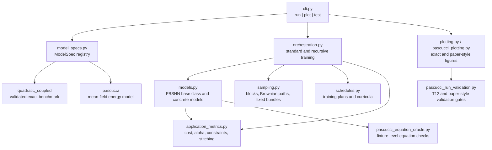

# final_recursive

TensorFlow 2 implementation of a recursive neural solver for coupled Forward-Backward Stochastic Differential Equations (FBSDEs).

This repository is part of my Bachelor's thesis in **Computer Science for Management**, Academic Year **2025/2026**. The thesis studies long-horizon neural FBSDE solvers for energy-storage control, with a validated quadratic benchmark and an application-oriented Pascucci mean-field model.

## What This Project Shows

- A modular scientific Python codebase built around TensorFlow 2, automatic differentiation, and reproducible numerical experiments.
- A recursive time-stitching algorithm: instead of training one network over a long horizon, the solver trains local time blocks, propagates terminal information backward, and stitches forward rollouts for evaluation.
- Separation between solver mechanics and model equations through a `ModelSpec` abstraction.
- A validation-first workflow: exact benchmark checks, TF1/TF2 parity where applicable, deterministic evaluation bundles, equation-level oracles, paper-style plot validators, and Monte Carlo confirmation artifacts.
- Research engineering discipline: explicit configs, seeds, metrics, output manifests, and documented limitations.

## Thesis Context

The motivating application is optimal energy-storage management for a residential battery/aggregator setting. Numerically, the project focuses on coupled FBSDEs where the unknown value function is approximated by a neural network `u(t, x)` and the `Z` component is recovered through TensorFlow automatic differentiation.

The repository evolved from a historical TensorFlow 1 prototype into a TensorFlow 2 package with clearer module boundaries, explicit model factories, and reproducible experiment artifacts.

## Architecture Overview



### Key Design Choices

- **Model abstraction.** `ModelSpec` provides model name, state labels, network layers, default parameters, sampling, exact-solution hooks, model factories, metric schemas, and pass-selection policy. This keeps orchestration code from depending on one concrete model.
- **Validated baseline.** `quadratic_coupled` remains the default model and regression target. It has exact formulas, exact error diagnostics, and compatibility tests against the historical implementation.
- **Application model isolation.** Pascucci-specific logic lives in dedicated model, calibration, metrics, plotting, oracle, and validation modules rather than being mixed into the solver core.
- **Explicit mean-field quantities.** Pascucci moments such as `mean_v`, `mean_q`, and `mean_h_plus_v` are treated as model-owned quantities and diagnostics, not hidden `reduce_mean` side effects.
- **Reproducible evaluation.** Fixed evaluation and rollout bundles carry schema, kind, block metadata, and hashes so repeated validation can use the same stochastic inputs.

## Supported Models

| Model | Purpose | Notes |
|---|---|---|
| `quadratic_coupled` | Validated 4D benchmark | Default model. Includes exact solution diagnostics and preserves the historical benchmark behavior. |
| `pascucci` | Thesis application model | Mean-field energy-storage model with OU calibration for price/load inputs, control through `Z_V`, application cost metrics, physical constraint diagnostics, and paper-style plotting. |

## Repository Map

| File | Responsibility |
|---|---|
| `cli.py` | Single entry point for `run`, `plot`, and `test` workflows. |
| `model_specs.py` | Model registry and factory layer. |
| `models.py` | TensorFlow 2 FBSNN base class plus concrete benchmark and Pascucci models. |
| `orchestration.py` | Standard training, recursive block training, rollout, pass selection, and artifact promotion. |
| `sampling.py` | Initial sampling, Brownian rollout construction, deterministic bundles, and bundle validation. |
| `exact.py` | Exact formulas and diagnostics for the quadratic benchmark. |
| `application_metrics.py` | Pascucci cost, controlled/uncontrolled comparison, alpha summaries, physical violations, and stitching diagnostics. |
| `pascucci_data.py` / `pascucci_calibration.py` | Data preparation and OU calibration for Pascucci inputs. |
| `pascucci_equation_oracle.py` / `pascucci_oracle_fixture.py` | Deterministic equation-level oracle checks. |
| `pascucci_plotting.py` | Paper-style Pascucci plot bundle generation from saved artifacts. |
| `pascucci_run_validation.py` | Validation gates for T12/T24/T72-style Pascucci runs and paper-style artifact contracts. |
| `tests.py` | In-package test runner and regression suite. |

## Quick Start

From a fresh clone:

```bash
python3 -m venv .venv
source .venv/bin/activate
python -m pip install --upgrade pip
python -m pip install -r requirements.txt
```

Because this repository root is itself the `final_recursive` package directory, run module commands with the parent directory on `PYTHONPATH`:

```bash
PYTHONPATH=.. python -m final_recursive test
```

Optional parity checks compare the TensorFlow 2 implementation with the historical TensorFlow 1-style reference where available:

```bash
PYTHONPATH=.. python -m final_recursive test --include-v1-parity
```

Run a tiny recursive benchmark experiment:

```bash
PYTHONPATH=.. python -m final_recursive run \
  --model quadratic_coupled \
  --mode recursive \
  --T_total 12 \
  --block_size 2 \
  --M 32 \
  --N 8 \
  --passes 1 \
  --exact_solution quadratic_coupled \
  --output_dir recursive1_outputs/demo_quadratic
```

Regenerate Pascucci paper-style plots from an existing run directory:

```bash
PYTHONPATH=.. python -m final_recursive plot --run_dir recursive1_outputs/path_to_run
```

## Pascucci Runs

For paper-style Pascucci experiments, calibration sources should be explicit:

```bash
PYTHONPATH=.. python -m final_recursive run \
  --model pascucci \
  --mode recursive \
  --exact_solution none \
  --pascucci_require_calibration \
  --pascucci_H_path dataset/casa/2025dicembre1.csv \
  --pascucci_S_path dataset/prezzi/2025dicembre1.xlsx \
  --T_total 24 \
  --block_size 2 \
  --M 10000 \
  --N 13 \
  --passes 1
```

The dataset paths above are examples from the thesis workspace. They are not bundled in this public repository.

## Validation Strategy

The codebase is designed so that risky numerical changes have a small, reviewable validation target.

- **Benchmark preservation:** `quadratic_coupled` remains the default and is guarded by exact formulas, smoke tests, output-schema tests, and model-spec factory tests.
- **TensorFlow migration checks:** selected tests compare TF2 predictions, parameter blobs, and optimizer behavior against the historical implementation.
- **Shape, dtype, and finiteness gates:** Pascucci equations and recursive losses are checked before long runs.
- **Mean-field moment tests:** Pascucci runtime moments are explicit, forwarded through the model-owned context, and exposed in diagnostics.
- **Equation oracles:** deterministic fixtures compare Pascucci equation pieces such as drift, diffusion, terminal cost, running cost, and control formulas.
- **Fixed stochastic inputs:** evaluation and rollout bundles make pass-to-pass comparisons reproducible.
- **Application metrics:** Pascucci emits pathwise cost `J`, controlled versus uncontrolled paired comparisons, alpha summaries, physical violation rates, and stitching diagnostics.
- **Paper-style plotting contract:** plot artifacts include manifests, plot-data arrays, style metadata, source declarations, and validators that reject unsupported paper-parity claims.
- **Monte Carlo confirmation:** selected runs can add an independent post-selection MC confirmation bundle.

## Current Experimental Status

The repository contains the implementation and validation tooling used during the thesis work. The latest documented thesis experiments include:

- A `T=24` Pascucci paper-like, calibrated, single-pass run that passed the local paper-style artifact, science, and MC validation gates after path-local revalidation.
- A `T=72` Pascucci calibrated single-pass exploratory run with favorable controlled versus uncontrolled cost metrics and independent MC confirmation.
- Known caveat: Pascucci multi-pass recursive stability remains an open research limitation. In diagnostics, later passes can amplify the `Z_V -> alpha -> V/Q` channel even when the selected single-pass artifact is valid.
- Known caveat: visual validation is structural and data-backed, not pixel-exact. Pixel-exact claims require stable golden images and hash checks, which are intentionally not claimed here.

## Public Data Caveat

Core package tests use synthetic fixtures and deterministic generated inputs. Some thesis-level paper-parity workflows depend on local historical sources and datasets from the private thesis workspace, including Pascucci reference code and calibrated `H/S` input files. Those files are not bundled here, so public users should treat paper-parity commands as reproducible pipeline examples unless they provide equivalent data.

## Why This Matters

For a recruiter or reviewer, this project is meant to show more than a numerical experiment that happened to run. It demonstrates how I structure a research codebase so that mathematical modeling, machine learning implementation, experiment discipline, and software architecture can be inspected separately.

The main engineering theme is protected variation: the solver can evolve, benchmarks can remain frozen, and new model families can be added without turning the orchestration layer into a collection of model-specific exceptions.
